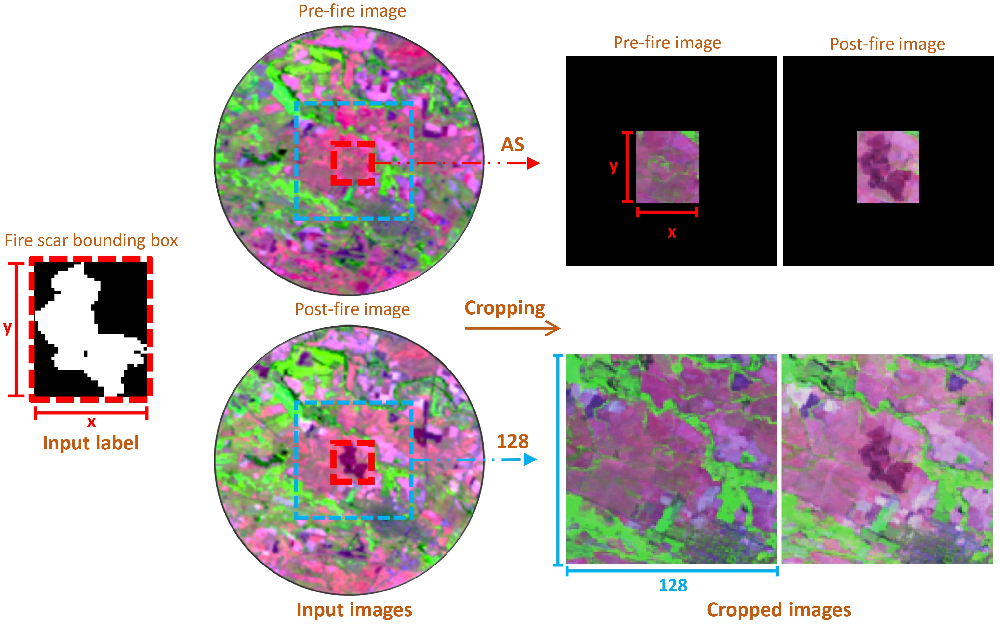
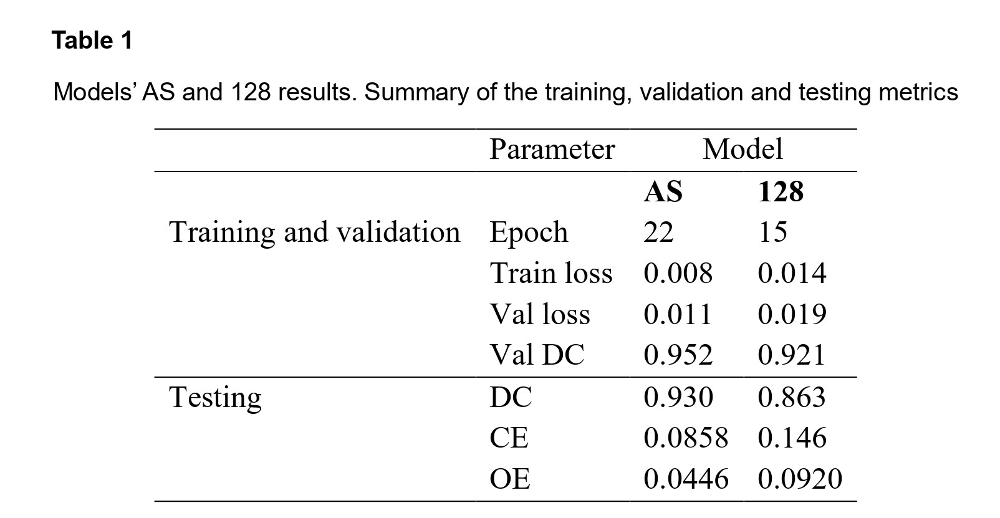
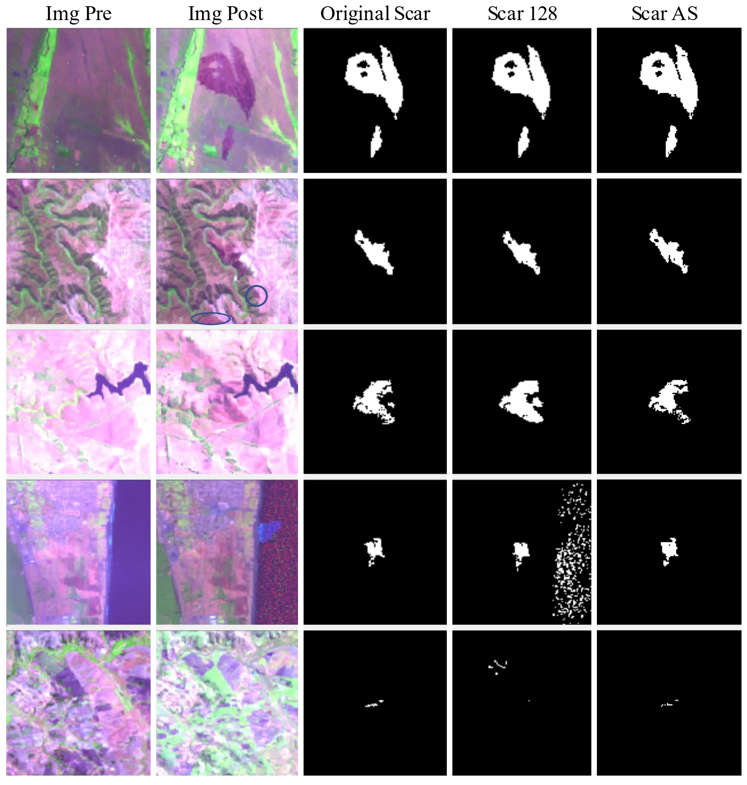

# Automatic burned area mapping approach using Deep Learning 

#### Ian Wulff-Limongi, Jaime Carrasco, Cristobal Pais, Alejandro Miranda and Andres Weintraub
---
#### Project on automatic recognition of fire scars using LANDSAT's satellite imagery applying the U-Net model
---
### Abstract 

Wildfires are a critical problem among the last years worldwide due to their consequences, such
as the carbon footprint, besides other ecological, economic and social impacts. Correspondingly,
studying the affected areas is necessary, mapping every fire scar, typically using satellite data.
In this paper, we propose a Deep Learning (DL) automate approach, using the U-Net model and
Landsat imagery, that could become a straightforward automate alternative. Thus, two models
were evaluated, each trained with a dataset with a different class balance, produced by cropping
the input images to different sizes, to a determined and variable size: 128 and AllSizes (AS),
including a better and worse class balance respectively. The testing results using 195 represen-
tative images of the study area: Dice Coefficient (DC)=0.93, Omission error (OE)=0.086 and
Commission Error (CE)=0.045- for AS, and DC=0.86, OE=0,12 and CE=0,12 for 128, proving
that a better balanced dataset results on a better performance.

---
### Material and Methods

Two specific datasets were cropped out from the files of The Landscape Fire Scars Database, to evaluate the performance using different image sizes. These datasets included **1966** fires, dividing the data almost equally for each region, **with 977 events from Valparaíso and 989 from BioBío**. 

Within the Convolutional Neural Network (CNN), the model U Net was selected for the prediction of the burned areas.

---

### Results

In the Table 1 can be seen the results for each model, AS and 128.

Finallly, some highlights of the models' performance can be seen:

