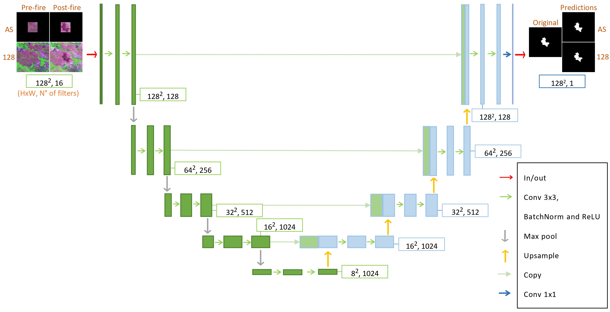

# Automatic_Fire_Scars_Mapping
Project on automatic recognition of fire scars using LANDSAT's satellite imagery applying the U-Net model
Two specific datasets were constructed from The Landscape Fire Scars Database, to evaluate the performance using different image sizes. 

Within the Convolutional Neural Network (CNN), the model U Net was selected for the prediction of the burned areas.

Finallly, some highlights of the model's performance can be seen.

